---

# 1

## Bài 1:

1. **Lưu đồ hệ thống tiền lương**

   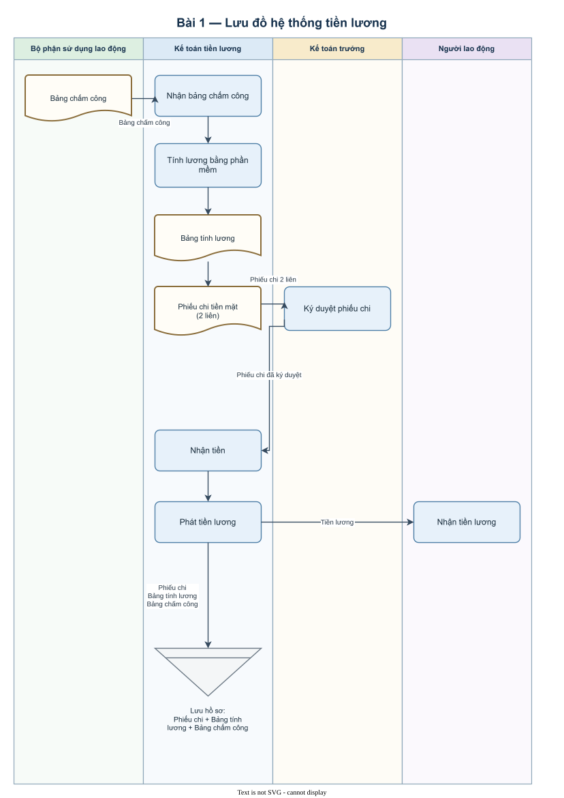

2. Những nguy cơ của hệ thống:
   - Dữ liệu chấm công có thể không chính xác hoặc chưa được xác nhận, dẫn đến tính lương sai.
   - Chỉ kế toán tiền lương có quyền truy cập, sửa chữa và điều chỉnh thông tin nhưng không có bước kiểm tra độc lập đối với các thay đổi.
   - Kế toán tiền lương đồng thời tính lương, lập phiếu chi, nhận tiền, phát tiền và lưu chứng từ, làm thiếu sự phân chia trách nhiệm.
   - Kế toán tiền lương có thể sửa dữ liệu lương hoặc tạo giao dịch lương không hợp lệ để chiếm đoạt tiền.
   - Có nguy cơ chi trả sai người hoặc sai số tiền do quy trình không nêu bước đối chiếu danh tính người nhận và số tiền thực tế phát.
   - Có nguy cơ thất thoát tiền mặt do người tính lương cũng trực tiếp nhận và phát tiền.
   - Việc kiểm tra và phê duyệt chưa đầy đủ vì kế toán trưởng chỉ ký phiếu chi, không nêu việc đối chiếu phiếu chi với bảng tính lương và bảng chấm công.
   - Chứng từ và dữ liệu có thể bị thất lạc, sửa đổi hoặc truy cập không phù hợp vì quy trình không nêu biện pháp bảo vệ, phân quyền hay sao lưu.

## Bài 2:

1. **Lưu đồ quy trình thanh toán tiền lương**

   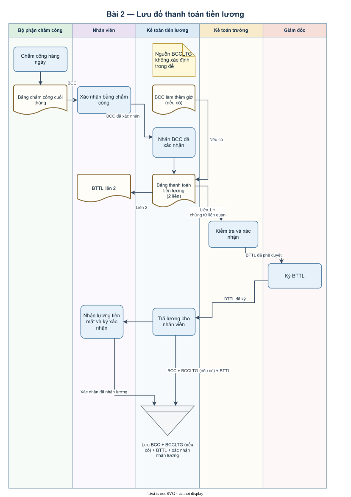

2. **Sơ đồ dòng dữ liệu quy trình thanh toán tiền lương**

   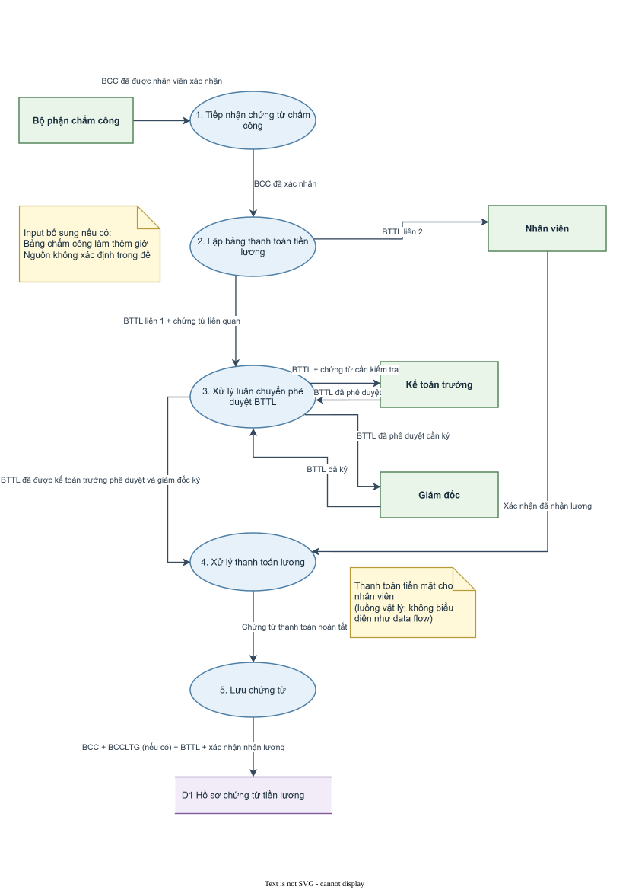

---

# 2

## Sơ đồ dòng dữ liệu hệ thống bán trái cây tươi và thu tiền

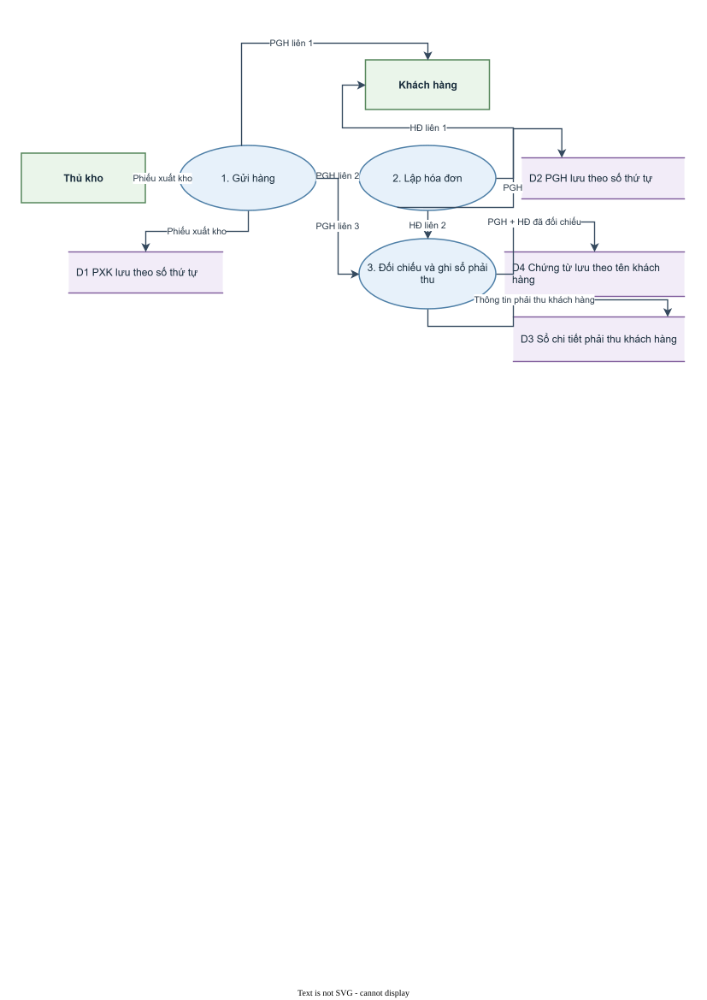

## Lưu đồ hệ thống bán trái cây tươi và thu tiền

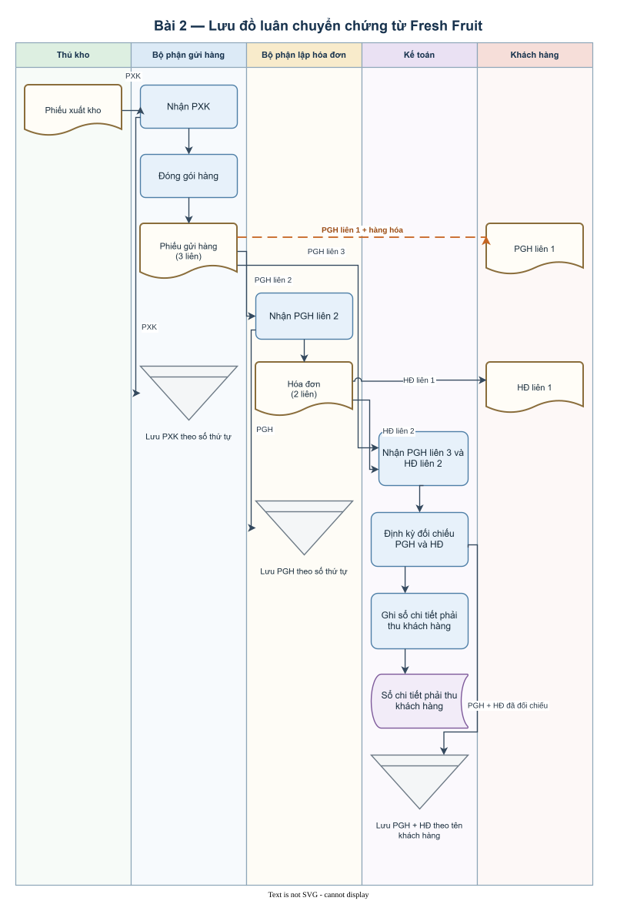

---

# 3

1. 

| Đối tượng | Hoạt động |
|---|---|
| Bộ phận có nhu cầu mua hàng | Lập đơn đề nghị mua hàng 2 liên và trình lãnh đạo công ty phê duyệt; chuyển liên 1 đã duyệt cho bộ phận mua hàng và liên 2 cho bộ phận kế toán. |
| Lãnh đạo công ty | Phê duyệt đơn đề nghị mua hàng. |
| Bộ phận mua hàng | Nhận đơn đề nghị mua hàng liên 1; lựa chọn nhà cung cấp; lập đơn đặt hàng 3 liên; lưu liên 1, gửi liên 2 cho nhà cung cấp, gửi liên 3 cho kế toán; phối hợp với bộ phận kho kiểm đếm, nhận hàng và xác nhận hàng. |
| Nhà cung cấp | Nhận đơn đặt hàng; giao hàng; gửi hóa đơn cho phòng kế toán; nhận tiền thanh toán. |
| Bộ phận kho | Phối hợp với bộ phận mua hàng kiểm đếm, nhận và xác nhận hàng; lập phiếu nhập kho 2 liên; chuyển liên 1 cho kế toán và lưu liên 2 tại kho. |
| Phòng kế toán | Nhận đơn đề nghị mua hàng liên 2, đơn đặt hàng liên 3, phiếu nhập kho liên 1 và hóa đơn; đối chiếu chứng từ với hóa đơn; ghi sổ mua hàng; xử lý thanh toán cho nhà cung cấp. |

2. **Sơ đồ dòng dữ liệu tổng quát**

   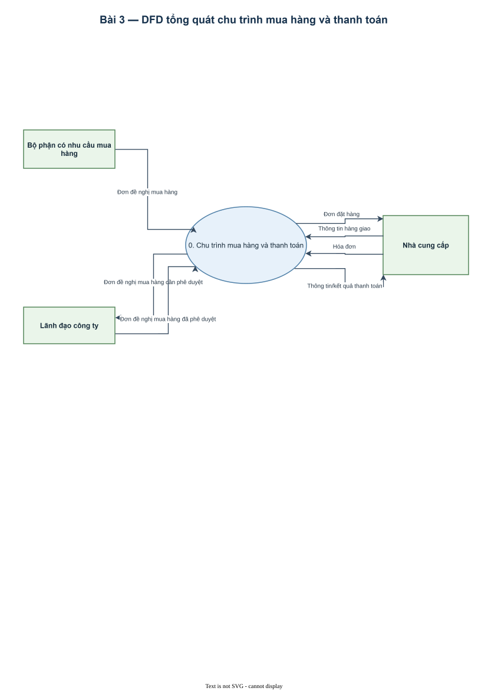

   **Sơ đồ dòng dữ liệu chi tiết cấp 0**

   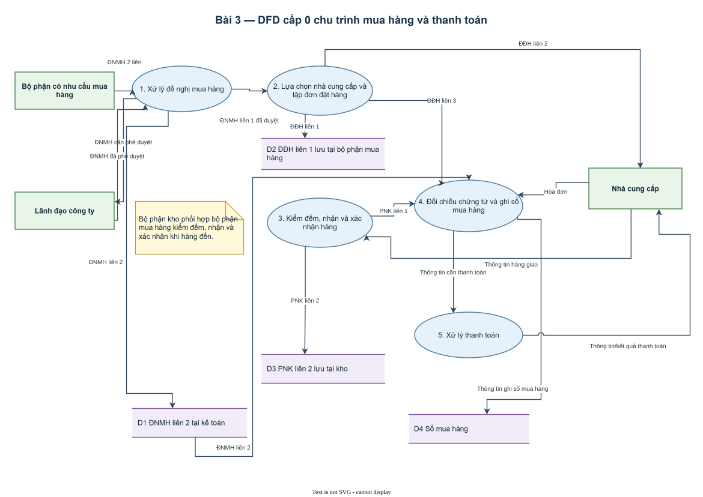

3. Những nguy cơ có thể xảy ra:
   - Mua hàng không cần thiết, vượt nhu cầu hoặc chưa được phê duyệt hợp lệ.
   - Bộ phận mua hàng có thể lựa chọn nhà cung cấp không phù hợp hoặc thông đồng với nhà cung cấp.
   - Đơn đặt hàng có thể bị lập sai, lập trùng, bỏ sót hoặc xử lý không đúng chứng từ đã được phê duyệt.
   - Có thể nhận thiếu hàng, sai hàng hoặc hàng kém chất lượng do không nêu bước kiểm tra chất lượng độc lập.
   - Phiếu nhập kho có thể không phản ánh đúng số lượng hàng thực nhận.
   - Kế toán có thể ghi nhận hóa đơn không hợp lệ, hóa đơn trùng hoặc hóa đơn không khớp với hàng đã nhận nếu việc đối chiếu không đầy đủ.
   - Có thể thanh toán sai nhà cung cấp, sai số tiền hoặc thanh toán hai lần do kế toán vừa ghi nhận vừa xử lý thanh toán và không nêu bước phê duyệt thanh toán độc lập.
   - Chứng từ chuyển chậm hoặc thiếu có thể làm giao dịch được ghi nhận sai kỳ hoặc làm sai số dư công nợ, hàng tồn kho.
   - Chứng từ có thể bị thất lạc hoặc sử dụng lại do quy trình không nêu việc đánh số trước và kiểm tra tính liên tục của chứng từ.

---

# 4

1. 

| Đối tượng | Hoạt động |
|---|---|
| Phòng thiết kế | Lập bản vẽ công trình 3 bản; lưu 1 bản; gửi 1 bản cho phòng dự án và 1 bản cho đội thi công. |
| Phòng dự án | Nhận bản vẽ công trình; lập dự toán công trình và kế hoạch thi công từng giai đoạn; gửi dự toán và kế hoạch cho kế toán; chỉ gửi kế hoạch thi công cho đội thi công. |
| Đội thi công | Nhận bản vẽ công trình và kế hoạch thi công; lập đề nghị cấp vật tư theo giai đoạn gửi thủ kho; nhận vật tư để thi công. |
| Thủ kho | Nhận đề nghị cấp vật tư; kiểm tra, đối chiếu khối lượng vật tư tồn kho; lập đề nghị mua vật tư 2 liên; lưu liên 1, chuyển liên 2 cho phòng vật tư; nhận vật tư từ phòng vật tư; lập phiếu nhập kho 2 liên; lưu liên 1, chuyển liên 2 cho kế toán; giao vật tư cho đội thi công. |
| Phòng vật tư | Nhận đề nghị mua vật tư liên 2; mua vật tư theo kế hoạch; nhận vật tư; lập và chuyển biên bản giao nhận cho kế toán; chuyển vật tư cho thủ kho. |
| Kế toán | Nhận dự toán và kế hoạch thi công; nhận hóa đơn (đề không nêu nguồn), biên bản giao nhận và phiếu nhập kho liên 2; đối chiếu chứng từ và ghi sổ kế toán. |

2. **Lưu đồ tài liệu quy trình cấp và mua vật tư**

   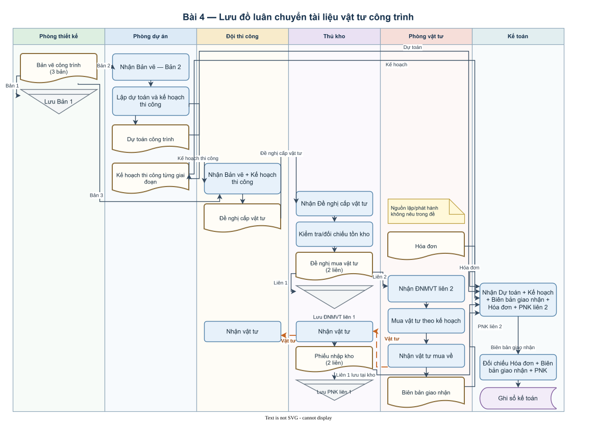

3. Những nguy cơ có thể xảy ra:
   - Các bộ phận có thể sử dụng sai phiên bản bản vẽ hoặc kế hoạch thi công nếu có thay đổi nhưng không được cập nhật đồng bộ.
   - Dự toán hoặc nhu cầu vật tư có thể không chính xác, dẫn đến mua thiếu, mua thừa hoặc cấp vật tư không đúng giai đoạn.
   - Thủ kho tự lập đề nghị mua vật tư nhưng quy trình không nêu bước phê duyệt của người có thẩm quyền.
   - Phòng vật tư có thể mua sai giá, sai chủng loại hoặc thông đồng với nhà cung cấp do quy trình không nêu việc so sánh báo giá, phê duyệt nhà cung cấp hoặc điều kiện mua.
   - Phòng vật tư vừa mua vừa nhận vật tư, làm thiếu sự kiểm tra độc lập về số lượng và chất lượng hàng nhận.
   - Không có đơn đặt hàng hoặc chứng từ mua hàng được phê duyệt làm căn cứ để thủ kho đối chiếu vật tư thực nhận.
   - Việc giao vật tư cho đội thi công không nêu việc lập phiếu xuất kho hoặc ký nhận, nên có nguy cơ cấp sai, cấp vượt hoặc thất thoát vật tư.
   - Kế toán chỉ đối chiếu hóa đơn, biên bản giao nhận và phiếu nhập kho, trong khi quy trình không có đơn đặt hàng và không có bước phê duyệt đề nghị mua, nên thiếu căn cứ độc lập để xác minh giao dịch mua đã được cho phép.
   - Vật tư có thể bị sử dụng sai công trình hoặc sai giai đoạn do quy trình không nêu việc theo dõi riêng theo công trình và giai đoạn.
   - Chứng từ có thể bị thất lạc hoặc ghi nhận sai kỳ do luân chuyển qua nhiều bộ phận nhưng không nêu việc đánh số và theo dõi thời hạn chuyển chứng từ.

---

# 5

## Sơ đồ dòng dữ liệu hệ thống bán trái cây tươi và thu tiền

---

# 6

1. **Sai.** Hệ thống sổ kế toán chỉ là một bộ phận của hệ thống thông tin kế toán, không thể mặc nhiên xem là thành phần quan trọng nhất. Hệ thống thông tin kế toán còn bao gồm con người, quy trình, dữ liệu, phần mềm, cơ sở hạ tầng và các biện pháp kiểm soát.

2. **Sai.** Ghi nhận khoản phải thu thường phát sinh ở bước lập hóa đơn hoặc ghi nhận bán chịu, không phải rủi ro trọng yếu nhất ngay khi tiếp nhận đơn đặt hàng. Ở khâu tiếp nhận đơn hàng, các rủi ro chính là nhận đơn không hợp lệ, sai thông tin hoặc chấp nhận khách hàng không đủ khả năng thanh toán.

3. **Sai.** Giao toàn quyền chấm công và tính kết quả lao động cho một bộ phận làm mất sự phân chia trách nhiệm. Bộ phận sử dụng lao động hoặc người quản lý trực tiếp nên xác nhận thời gian và kết quả làm việc; các bộ phận nhân sự và kế toán thực hiện các chức năng của mình; người có thẩm quyền kiểm tra và phê duyệt.

4. **Sai.** Chứng từ kế toán, sổ kế toán chi tiết và sổ kế toán tổng hợp chỉ là các cấu phần ghi chép và dữ liệu kế toán. Hệ thống thông tin kế toán còn có con người, quy trình xử lý, phần mềm, cơ sở hạ tầng công nghệ và các biện pháp kiểm soát nội bộ.

---

# 7

## Bài 1:

### Sơ đồ dòng dữ liệu tổng quát

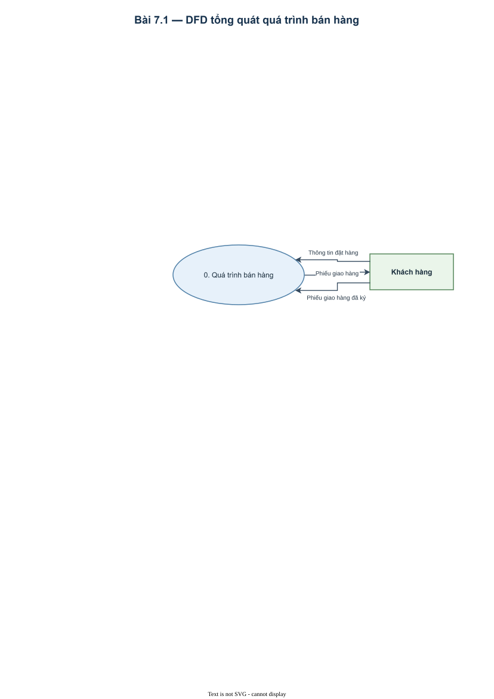

### Sơ đồ dòng dữ liệu chi tiết cấp 0

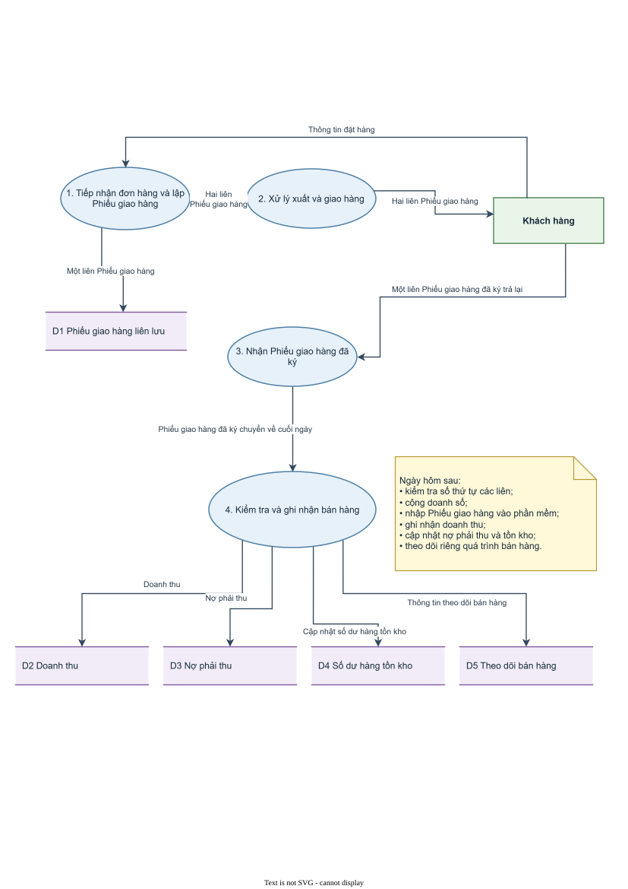

## Bài 2:

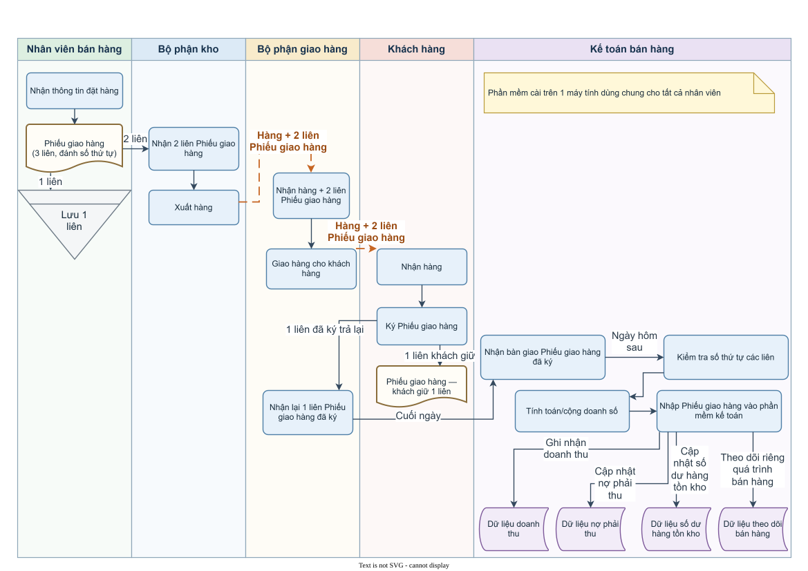
